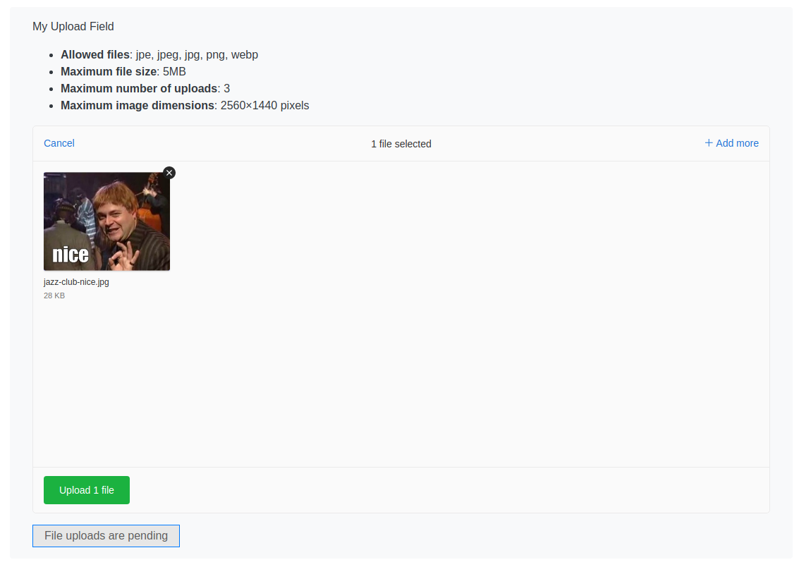

# A damn fine file upload module for Silverstripe

An upload field that can be used to upload files to a Silverstripe website.

Uses [Uppy](https://uppy.io/) to handle & submit client uploads.

> This module is not intended for use in the Silverstripe administration area, use the standard UploadField for that.

## Browser support

The Uppy website provides [a list of supported browsers](https://uppy.io/docs/#Browser-Support)

I do not support Internet Explorer, any bugs raised related to IE will be closed.

## Installing

```
composer require codem/silverstripe-damn-fine-uploader
```

## Configuration

Have a look in ```_config/config.yml``` for various configuration options and see also [Default Configuration](./docs/en/003_configuration.md)

> Modify the ```signing_key``` value in your project configuration, along with anything else you like (e.g upload size limits)

The ```implementation``` entry can be used to add any configuration value supported by the field.

The Upload field itself sets some request-time configuration options, passed to the field.
+ 'messages'
+ 'form'
+ 'request' - specifically the method and the request endpoint
+ 'text'

## Fields

### UppyField

A file upload field can be created in the usual way within a Controller:

```php
namespace My\Fun\App;

use Codem\DamnFineUploader\UppyField;
use Silverstripe\Forms\FieldList;
use Silverstripe\Forms\FormAction;
use Silverstripe\Forms\Form;


class MyController extends \PageController {

    // ...

    /**
     * In your template use {$UploadForm} to display this Form
     * @return Form
     */
    public function UploadForm()
    {
        // create the field
        $upload_field = UppyField::create('MyUploadField', 'My Upload Field');
        $fields = FieldList::create(
            $upload_field
        );
        $actions = FieldList::create(
            FormAction::create(
                'doAnUpload',
                'Upload'
            )->setAttribute('data-uploads-pending','File uploads are pending')
        );
        $form = Form::create($this, 'UploadForm', $fields, $actions);
        return $form;
    }

    // ...
}
```

Submit buttons on the form are given the "disabled" attribute when uploads have not yet completed.

You can use the optional "data-uploads-pending" data attribute on the form action to specify text that will be displayed when file(s) were added to the field but not yet uploaded.

If this is not set, the value of the disabled button in this example will remain as "Uploads"

### Example field



### Editable fields for the silverstripe/userforms module

An ```EditableUploadField``` field is available for use in user generated forms.

The field can be added in the usual userforms way and the following options are available:

+ Maximum file size (MB)
+ Upload folder target within the assets directory (default: Uploads)
+ Limit number of uploaded files
+ Option to use a year/month/day folder storage schema, under the selected folder

Submitted files are stored on submission and linked to a ```SubmittedUploadField``` record.

## Issues

Please add feature requests and bug reports to the Github issue tracker

## License

BSD-3-Clause

## Thanks

Thanks for reading, here's a silly meme:


