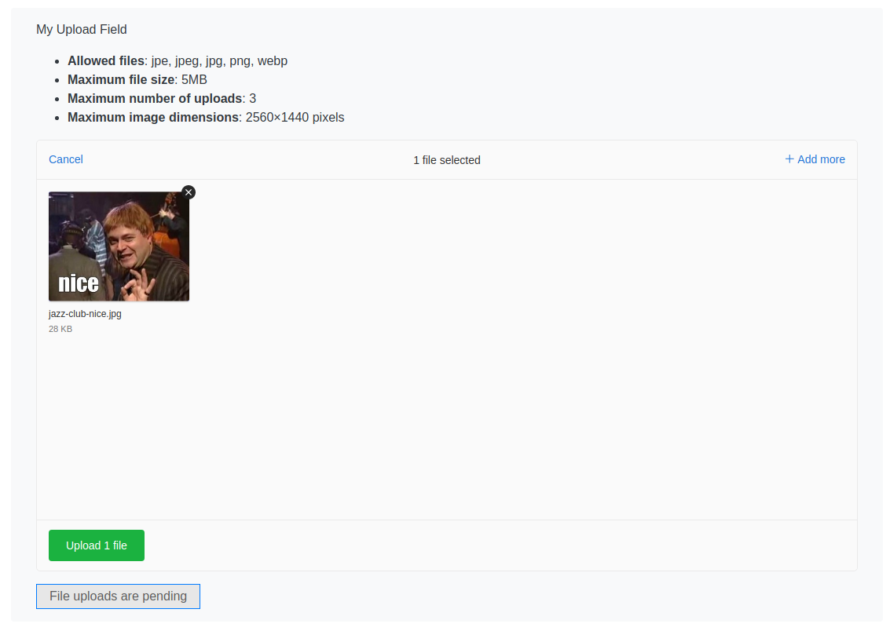

# Fields

## UppyField

> This field is used in the UploadPageController

A file upload field can be created in the usual Silverstripe way within a Controller:

```php
namespace My\Fun\App;

use Codem\DamnFineUploader\UppyField;
use Silverstripe\Forms\FieldList;
use Silverstripe\Forms\FormAction;
use Silverstripe\Forms\Form;


class MyController extends \PageController {

    // ...

    /**
     * In your template use {$UploadForm} to display this Form
     * @return Form
     */
    public function UploadForm()
    {
        // create the field
        $upload_field = UppyField::create('MyUploadField', 'My Upload Field');
        $fields = FieldList::create(
            $upload_field
        );
        $actions = FieldList::create(
            FormAction::create(
                'doAnUpload',
                'Upload'
            )->setAttribute('data-uploads-pending','File uploads are pending')
        );
        $form = Form::create($this, 'UploadForm', $fields, $actions);
        return $form;
    }

    // ...
}
```

See [handling uploaded files](../001_handling_uploaded_files.md) for information on how to retrieve and handle the files upload.

### Notes

Submit buttons on the form are given the "disabled" attribute when uploads have not yet completed.

You can use the optional "data-uploads-pending" data attribute on the form action to specify text that will be displayed when file(s) were added to the field but not yet uploaded.

If this is not set, the value of the disabled button in this example will remain as "Uploads"

### Example field



## Editable fields

An ```EditableUploadField``` field is available for use in user generated forms produced by the silverstripe/userforms module

The field can be added in the usual userforms way and the following options are available:

+ Maximum file size (MB)
+ Upload folder target within the assets directory (default: Uploads)
+ Limit number of uploaded files
+ Option to use a year/month/day folder storage schema, under the selected folder

Submitted files are stored on submission and linked to a ```SubmittedUploadField``` record.
