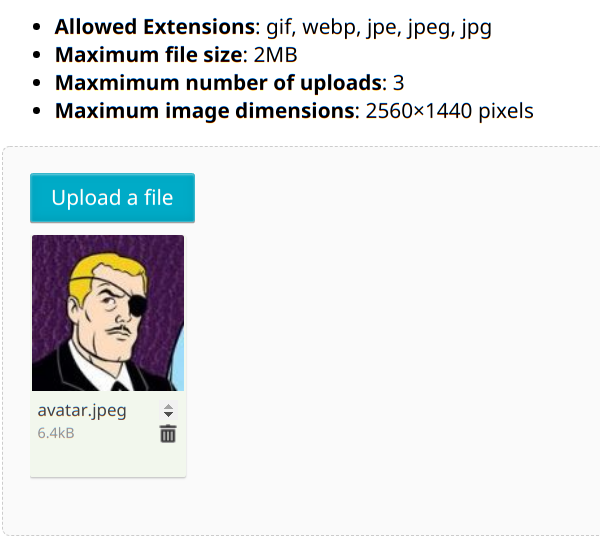
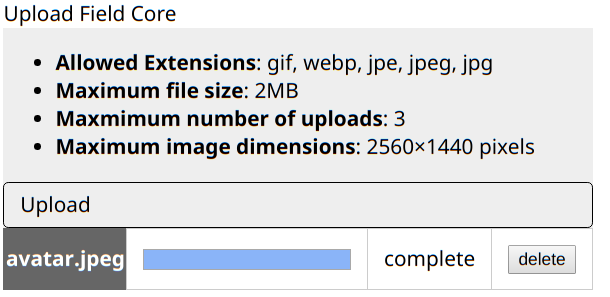

# FineUploader module for SilverStripe 4

This module provides two upload fields that can be used to upload files to a Silverstripe 4 website.

> It's not intended for use in the Silverstripe admin area or CMS, use UploadField for that.

## Installing

```composer require codem/silverstripe-damn-fine-uploader```

## Configuration

Have a look in ```_config/config.yml``` for various configuration options and seel also [Default Configuration](./docs/en/003_configuration.md)

> Modify the ```signing_key``` value in your project configuration, along with anything else you like (e.g upload size limits)

The 'fineuploader' entry can be used to add any configuration [supported by FineUploader](https://docs.fineuploader.com/branch/master/api/options.html).

The Upload field itself sets some request-time configuration options, passed to the field.
+ 'messages'
+ 'form'
+ 'request' - specifically the method and the request endpoint
+ 'text'

## Fields

### FineUploaderCoreField
Provides a core upload field, with no UI.
```
use Codem\DamnFineUploader\FineUploaderCoreField;
//...
$upload_field_core = FineUploaderCoreField::create('MyFieldName', 'Core Upload Field');
```

### FineUploaderField
Provides an upload field, with the standard FineUploader Gallery UI.
```
use Codem\DamnFineUploader\FineUploaderField;
//...
$upload_field = FineUploaderField::create('MyUploadField', 'Upload Field');
```

## Handling file submissions from forms
See [Handling Uploaded Files](./docs/en/001_handling_uploaded_files.md)

## Advanced
### Custom Request endpoint
You can override the request endpoint and options, e.g to direct uploads to another path or via another method
```
// pass an array $config matching request options
// https://docs.fineuploader.com/branch/master/api/options.html#request
$upload_field->setOptionRequest(
  $config
);
```

### Custom Delete endpoint
By default the field comes with no file delete handling. You can set a custom delete endpoint and it's up to you to handle the checks and balances around this (i.e roll your own).
```
// pass an array $config matching deleteFile options
// https://docs.fineuploader.com/branch/master/api/options.html#deleteFile
$upload_field->setOptionDelete(
  $config
);
```

### Field templates/layout/colours

Field templates look like this at the moment



The core field is an upload field that does not use the UI variant of FineUploader




## TODO
+ Make the upload fields a bit nicer on the eye by default. You can use standard CSS to target the upload field elements and modify to your requirements.

Please add feature requests and bug reports to the Github issue tracker


## Thanks
Many thanks to the [FineUploader team](https://fineuploader.com) for developing and supporting an excellent file uploader.
